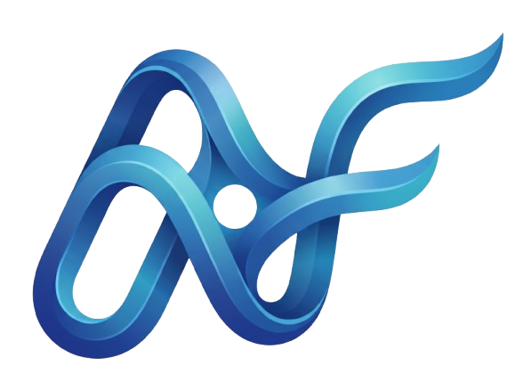
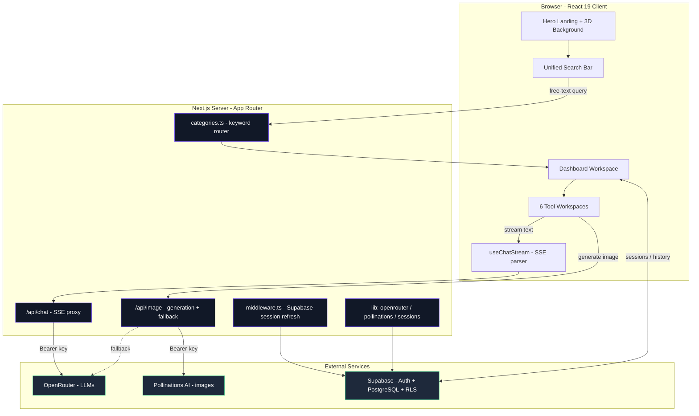
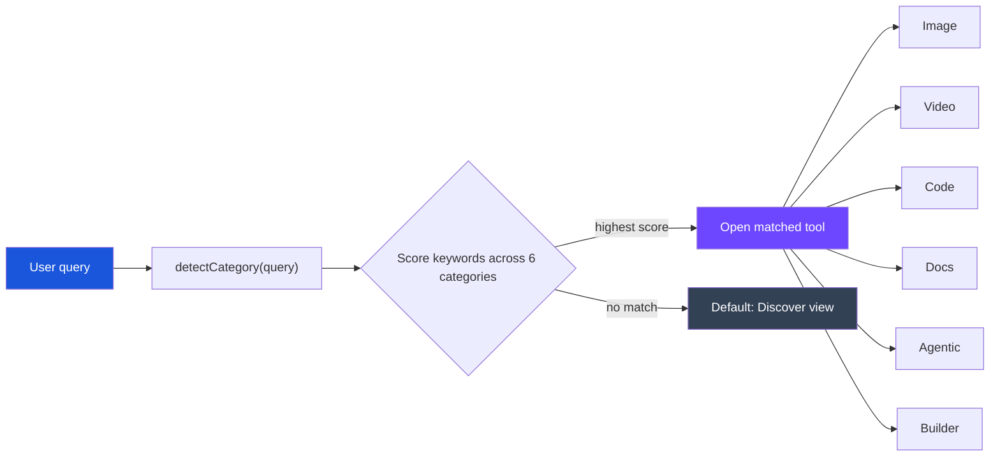

<div align="center">
    


# NexusFlow

### AI tools under one roof

**Discover, select and run AI tools — image, video, code, docs, autonomous agents and app builders — entirely inside one platform.**
No tab-hopping. No external redirects. Every model call stays server-side and on-platform.

<br/>

[](https://nextjs.org/)
[](https://react.dev/)
[](https://www.typescriptlang.org/)
[](https://tailwindcss.com/)
[](https://supabase.com/)
[](https://openrouter.ai/)

<br/>

</div>

---

## Overview

**NexusFlow** is a unified AI SaaS platform that aggregates six categories of AI tooling behind a single, cohesive interface. A user types what they want in plain language — *"write a React hook"*, *"a neon cyberpunk skyline"*, *"a landing page for a fitness app"* — and NexusFlow routes the request to the right embedded tool, runs the model, and streams the result **inline**. No redirects to third-party sites, no juggling a dozen logins.

```
"a neon cyberpunk skyline at dusk"  ──▶  Image Generation     ──▶  inline image
"refactor this SQL query"           ──▶  Code Generation       ──▶  streamed code
"5-step SaaS launch checklist"      ──▶  Agentic / Autonomous  ──▶  streamed plan
```

The platform is **demo-friendly by design**: it runs fully without any keys (localStorage history + neutral placeholders), and unlocks real-time generation the moment credentials are supplied.

---

## Key Features

| # | Feature | Description |
|---|---------|-------------|
| 🎯 | **Unified Search Router** | A keyword-scoring router maps free-text queries to the best-matching of 6 categories — from both the hero search bar and the dashboard. |
| 🖼️ | **Real Image Generation** | Server-side **Pollinations AI** generation (with OpenRouter image fallback). Token stays server-only; images returned as inline data URLs. |
| 💬 | **Streaming Text AI** | Server-Sent Events (SSE) proxy over **OpenRouter** streams tokens live for code, docs, agentic and builder tools. |
| 🧩 | **6 Embedded Tool Workspaces** | Image, Video, Code, Notes/Docs, Agentic, App/Website Builder — each with a model picker, prompt composer and inline output. |
| 🔐 | **Supabase Auth + RLS** | Email auth, profile auto-provisioning on signup, and Row-Level-Security so users only ever see their own data. |
| 💾 | **Session Persistence** | Every run is saved — to Supabase when authenticated, gracefully to `localStorage` in demo mode. |
| 🌌 | **Interactive 3D Hero** | A Canvas2D particle-network background with perspective projection, auto-rotation, pointer parallax and `prefers-reduced-motion` support. |
| 📱 | **Fully Responsive** | Flexbox/clamp-driven layouts that fit cleanly from mobile to ultrawide. |
| 🧪 | **Zero-Config Demo Mode** | Runs with no keys at all — perfect for evaluation and onboarding. |
| 🛡️ | **Keys Never Leave the Server** | All provider keys live in Route Handlers; the browser never sees them. |

---

## Tech Stack

| Layer | Technology | Notes |
|-------|-----------|-------|
| **Framework** | Next.js 15.5 (App Router) | Server Components + Route Handlers |
| **UI** | React 19 · TypeScript 5.7 (strict) | `@/*` path alias → `src/*` |
| **Styling** | Tailwind CSS v4 | CSS-based `@theme` config, custom keyframes |
| **API Layer** | Next.js Route Handlers | `/api/chat` (SSE), `/api/image` |
| **Text AI** | OpenRouter | One endpoint → many LLMs, streamed |
| **Image AI** | Pollinations AI | Server-side generation → data URLs |
| **Auth + DB** | Supabase (`@supabase/ssr`) | Email auth, PostgreSQL, RLS |
| **Icons** | lucide-react | Consistent line-icon set |
| **Runtime** | Node.js | `runtime = "nodejs"` on API routes |

> **Architecture note:** the original spec called for separate Node/Express + Python microservices. Those responsibilities are consolidated here into Next.js Route Handlers, keeping every AI call server-side and on-platform. They can be extracted into standalone services later without touching the frontend.

---

## System Architecture



---

## Search → Category Routing (Flowchart)

The keyword router that turns plain text into the right tool:



---

## Project Structure

```
NexusFlow by MetaMinds/
├── public/
│   └── nexusflow-mark.svg          # Brand mark
├── src/
│   ├── app/
│   │   ├── page.tsx                # Hero landing (3D background + search)
│   │   ├── layout.tsx              # Root layout + metadata
│   │   ├── globals.css             # Tailwind v4 @theme tokens + keyframes
│   │   ├── login/ · signup/        # Supabase auth pages
│   │   ├── dashboard/page.tsx      # Auth-gated workspace (server component)
│   │   └── api/
│   │       ├── chat/route.ts       # OpenRouter SSE streaming proxy
│   │       └── image/route.ts      # Pollinations → OpenRouter → placeholder
│   ├── components/
│   │   ├── brand/                  # NexusFlow + MetaMinds logos
│   │   ├── hero/                   # Hero3DBackground, SearchBar, ScaledDashboard
│   │   ├── auth/                   # AuthForm (login/signup/OAuth)
│   │   ├── dashboard/              # Sidebar, DiscoverView, DashboardClient
│   │   └── tools/                  # ToolFrame, ToolWorkspace, Markdown
│   ├── lib/
│   │   ├── categories.ts           # 6 categories, models, keyword router
│   │   ├── openrouter.ts           # Server-side OpenRouter client + image gen
│   │   ├── pollinations.ts         # Server-side Pollinations image client
│   │   ├── sessions.ts             # Persistence (Supabase / localStorage)
│   │   ├── useChatStream.ts        # Client SSE streaming hook
│   │   └── supabase/               # Browser + server clients
│   └── middleware.ts               # Supabase session refresh
├── supabase/
│   └── schema.sql                  # Tables, enums, RLS, triggers, seed data
├── next.config.mjs · postcss.config.mjs · tsconfig.json
└── .env.example
```

---

## Getting Started

### Prerequisites

- **Node.js 18.18+** (Node 20+ recommended)
- npm (or pnpm/yarn)

### Installation

```bash
# 1. Install dependencies
npm install

# 2. Configure environment
cp .env.example .env.local        # then fill in your keys (see below)

# 3. Run the dev server
npm run dev
```

Open **http://localhost:3100**

> The dev server runs on port **3100** (`next dev -p 3100`) to avoid conflicts with other local services.

### Demo Mode (no keys required)

NexusFlow runs with **zero configuration**:

- **No Supabase** → login/signup go straight to the dashboard; history saves to `localStorage`.
- **No OpenRouter key** → text tools report AI is unconfigured.
- **No Pollinations key** → image tools return neutral placeholders.

Add real keys to `.env.local` to unlock full real-time functionality.

---

## Environment Variables

| Variable | Required | Purpose |
|----------|:--------:|---------|
| `OPENROUTER_API_KEY` | for text AI | Powers all streaming text generation |
| `POLLINATIONS_API_KEY` | for images | Server-side image generation (token stays server-only) |
| `NEXT_PUBLIC_SUPABASE_URL` | for auth | Supabase project URL |
| `NEXT_PUBLIC_SUPABASE_ANON_KEY` | for auth | Supabase publishable/anon key |
| `NEXT_PUBLIC_SITE_URL` | optional | Public URL sent as the OpenRouter `HTTP-Referer` |

> `.env.local` is **gitignored** — secrets are never committed.

---

## Database Setup

1. Open your Supabase project → **SQL Editor** → **New query**.
2. Paste and run [`supabase/schema.sql`](supabase/schema.sql).

This creates `users`, `sessions`, `tool_catalog` and `chat_history`, enables **Row-Level Security**, seeds the tool catalog, and installs a trigger that auto-provisions a profile row on every new signup.

> For quick local testing you can disable email confirmation in **Authentication → Sign In / Providers → Email**.

---

## API Reference

### `POST /api/chat`

Streams a chat completion via OpenRouter as Server-Sent Events.

```jsonc
// Request
{
  "model": "openai/gpt-oss-120b:free",
  "messages": [{ "role": "user", "content": "Write a debounce hook" }],
  "temperature": 0.7,
  "maxTokens": 1800            // clamped server-side to a safe ceiling
}
// Response: text/event-stream  ->  data: { ...delta.content }
```

Returns **503** if no OpenRouter key is configured.

### `POST /api/image`

Generates an image, returning an inline data URL.

```jsonc
// Request
{ "prompt": "a neon cyberpunk skyline at dusk, ultra-detailed" }

// Response
{ "image": "data:image/jpeg;base64,...", "placeholder": false }
```

**Generation order:** Pollinations AI → OpenRouter image model → deterministic placeholder.

---

## Tool Categories

| Category | Interface | Example Models | Sample Prompt |
|----------|-----------|----------------|---------------|
| 🖼️ **Image Generation** | Prompt → inline image | Pollinations (Flux), Gemini Image | *"Minimalist logo for a coffee brand"* |
| 🎬 **Video Generation** | Prompt → inline clip | Runway, Kling, Pika | *"Drone shot over misty mountains"* |
| 💻 **Code Generation** | Editor + runner | Qwen3 Coder, GPT-OSS 120B | *"A React hook for debounced search"* |
| 📝 **Notes / Documents** | Rich text editor | GPT-OSS 120B, Nemotron, Llama 3.3 | *"Draft a product launch email"* |
| 🤖 **Agentic / Autonomous** | Pipeline builder | GPT-OSS 120B, Hermes 3 405B | *"5-step SaaS launch checklist"* |
| 🧱 **App / Website Builder** | Preview + download | Qwen3 Coder, Gemma 4 | *"A pricing table with three tiers"* |

Each category opens an embedded workspace with a model picker, prompt composer and inline output — the hero search bar and dashboard search route queries automatically.

---

## Design System

- **Palette:** neutral-dark surfaces — no rainbow grading. Brand blue `#1A56DB` is reserved for primary actions; semantic colors signal status only.
- **Contrast:** dark dashboard, light hero — clear context switching.
- **Motion:** staggered `fade-up` / `hero-rise` entrance animations; an interactive 3D particle hero that respects `prefers-reduced-motion`.
- **Layout:** flexbox + `clamp()` typography for fluid, fully responsive composition across all device sizes.
- **Tokens:** Tailwind CSS v4 `@theme` block in `globals.css` defines colors, animations and keyframes.

---

## Security

- 🔒 **Server-only keys** — all provider keys live in Route Handlers; the browser never receives them.
- 🛡️ **Row-Level Security** — Supabase RLS policies ensure users access only their own rows.
- 🚫 **No external redirects** — every AI interaction happens within NexusFlow.
- 🧾 **Secrets gitignored** — `.env.local` and editor/word lock files are excluded from version control.
- 🧮 **Token clamping** — request budgets are capped server-side to prevent runaway/over-budget calls.

---

## Roadmap

- [ ] Standalone Express / Python microservices for heavy workloads
- [ ] Real video generation provider integration
- [ ] Team workspaces + shared session libraries
- [ ] Usage analytics dashboard
- [ ] `pro` plan billing + quota enforcement
- [ ] Self-hostable Docker image

---

## Team

<div align="center">

**Team MetaMinds**

</div>

---

<div align="center">

© MetaMinds · NexusFlow

</div>
